# PyCitySchools
In this module challenge I removed the math and reading scores for all the 9th graders who attended Thomas High School. This removed the scores of 461 students out of 39,170, this is roughly 1.18% of the total. I believe that this will only minimally affect the data as it is such a small amount of the data set. I also cleaned the data set to remove prefixes and suffixes. The cleaned data is presented in the below table. Note the NaN entries for the 9th graders at Thomas High School 
- 

# District Summary
There were a few differences in the district data. Below are the differences
- Average Math Score: the new score went down by 0.1
- Average Reading Score: this stayed the same
- % Passing Math: went down by 1%
- % Passing Reading: went down by 1%
- % Overall Passing: went down by 1%
    
# Old District Summary
-   

# New District Summary
- 

# School Summary
Here we can see a large change. In the old school summary, Thomas High School was ranked #2 overall with an overall passing rate of 90.94%. 
# Top Performers Old School Data
- 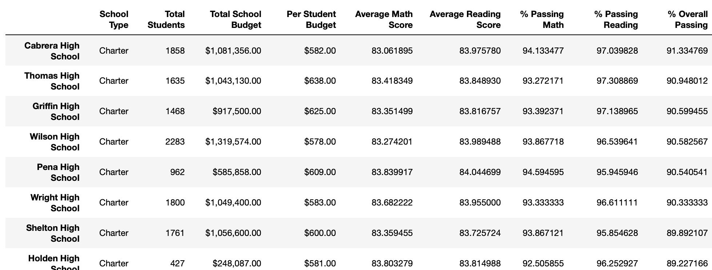
When we removed all the 9th grader's scores, the school dropped in the rankings to 8th place with an overall passing % of 65.07%, a decrease of 25.87% 
# Top Performers New School Data
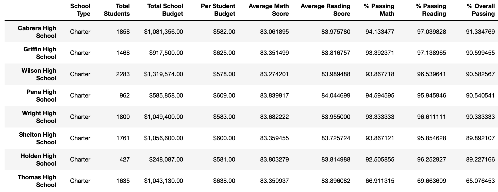

- Average Math Score: went down from 83.41 to 83.35 to 6th place from 4th
- Average Reading Score: this score went up from 83.85 to 83.90 which remains unchanged in the rankings at 5th place
- % Passing Math: big drop from 93.27 to 66.91. 9th place, previously 7th
- % Passing Reading: big drop from 97.31 69.66 last place from previously being first. 
- % Overall Passing: big drop from 90.95 to 65.08 to 8th place from second

The above data shows how the 9th grade changes affect the school versus its peers. Only the Thomas school data has changed, and it has meant a significant drop in the rankings if we look at the overall score.

The below data shows how the data has changed due to removal of the grades

# By Grade:
# Math:
- Only the data for the 9th graders in Thomas High School has been converted to NaN. The school was tied for 2nd before the removal in math.
- all the other data remains the same as no other part of the dataset was touched.
# Old Math Data
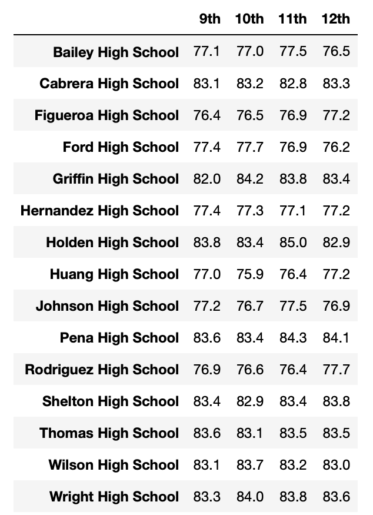
# New Math Data
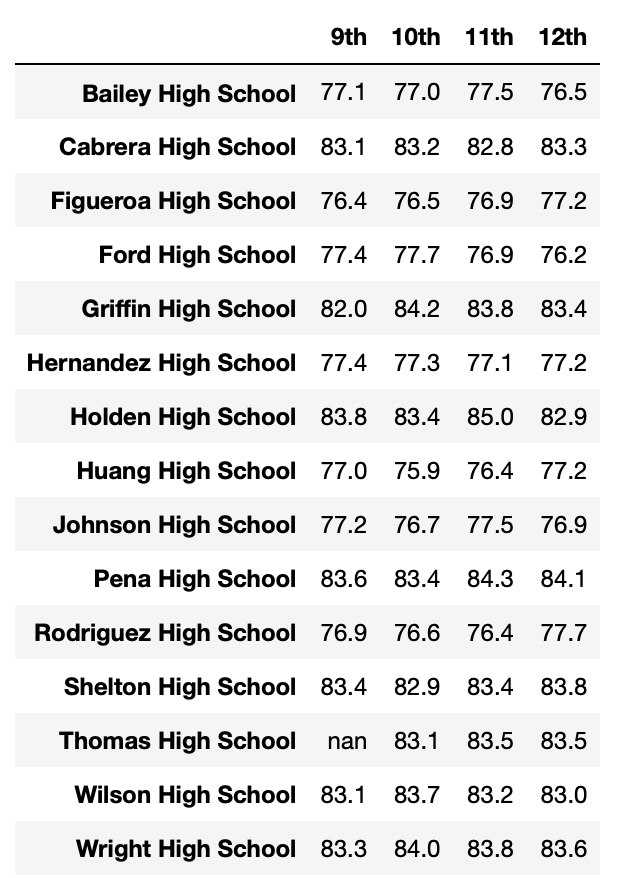

# Reading:
- Thomas school was previously the 5th best school before it was replaced by Nan.
- all the other data remains the same as no other part of the dataset was touched.
# Old Reading Data
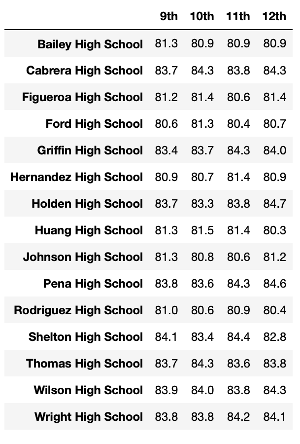
# New Reading Data
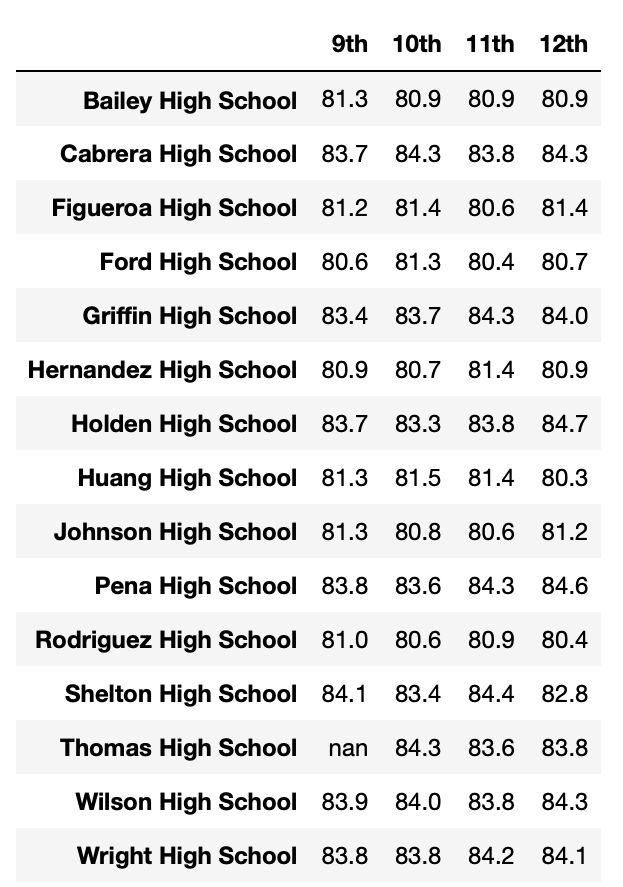

# Spending
- The only spending category that has changed is the $630-644, as that is where the Thomas High School fits into. 
- Average Math Score: unchanged
- Average Reading Score: unchanged
- % Passing Math: went down by 6%
- % Passing Reading: went down by 7%
- % Overall Passing: went down by 7%

# Old School Spending Data

# New School Spenging Data
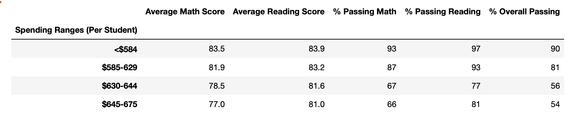

# School Size
- Thomas High School is classified as a medium sized school. That means that this is the only affected bracket. All others remained the same.
- Average Math Score: unchanged
- Average Reading Score: unchanged
- % Passing Math: -6%
- % Passing Reading: -6%
- % Overall Passing: -6%

# School Size Old
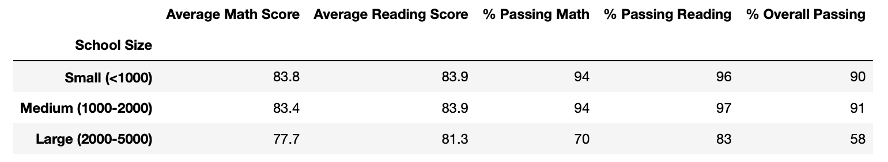
# School Size New
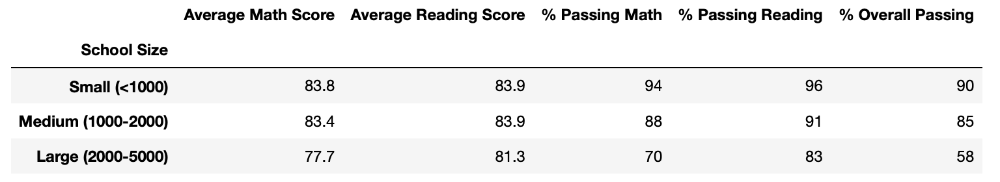

# School Type
- Thomas High School is a charter school so that is the only school type that is affected.

Changes for the charter schools:
- Average Math Score: unchanged
- Average Reading Score: unchanged
- % Passing Math: -4%
- % Passing Reading: -4%
- % Overall Passing: -3%

# School Type Old
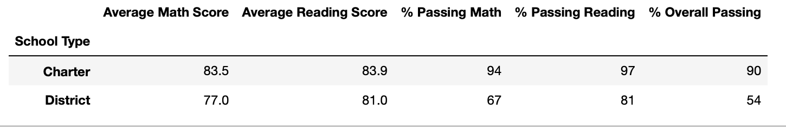
# School Type New
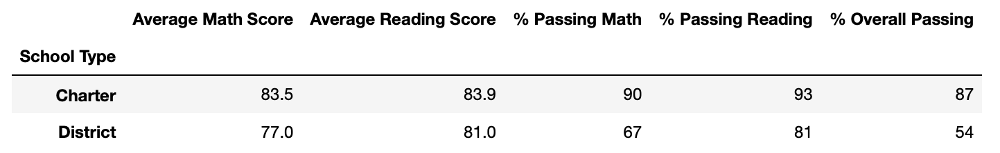

