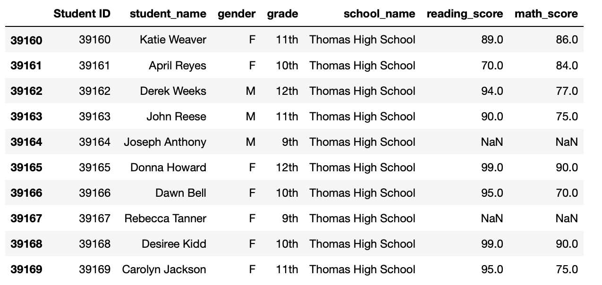
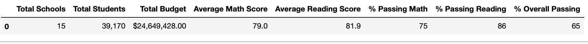
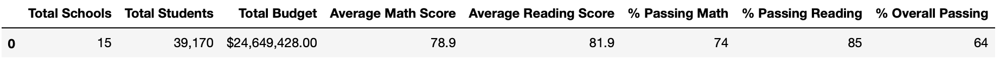

# PyCitySchools
- 
In this module challenge I removed the math and reading scores for all the 9th graders who attended Thomas High School. This removed the scores of 461 students out of 39,170, this is roughly 1.18% of the total. I believe that this will only minimally affect the data as it is such a small amount of the data set. I also cleaned the data set to remove prefixes and suffexes. The cleaned data is presented in the below table. Note the NaN entries for the 9th graders at Thomas High School 
- 

                                    District Summary
There were a few differences in the district data. Below are the differences
Average Math Score: the new score went down by 0.1
Average Reading Score: this stayed the same
% Passing Math: went down by 1%
% Passing Reading: went down by 1%
% Overall Passing: went down by 1%
    
                                        Old District Summary
-                                                                        New District Summary
- 

